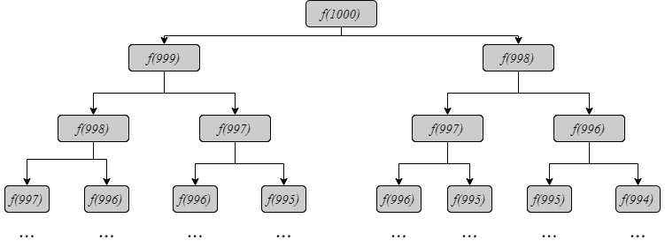
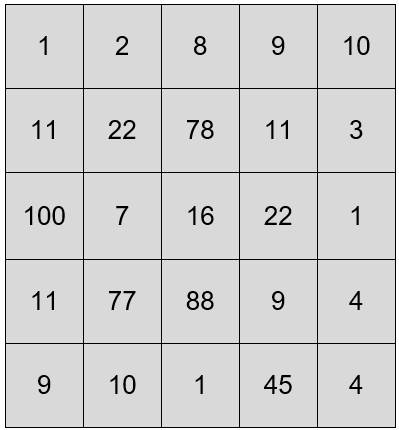
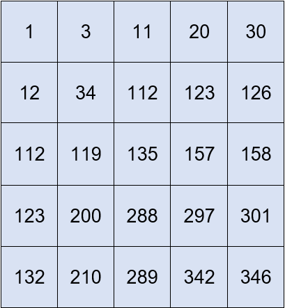
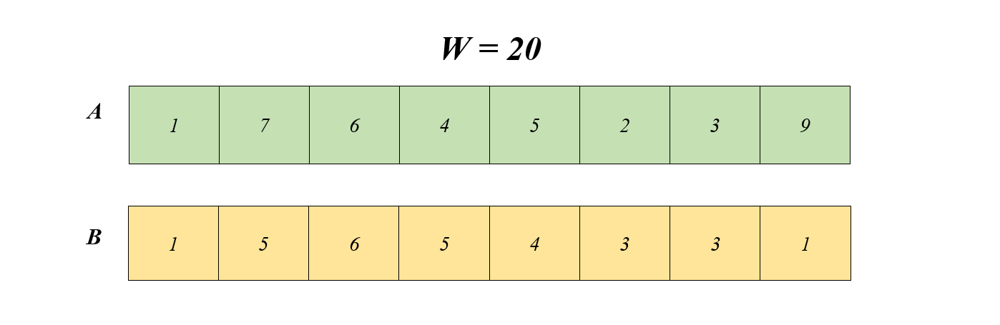

## Thuật Toán
### 1. Kiến thức cần nắm 
#### Vector
Vector là mảng động lưu các đối tượng có cùng dữ liệu. 
##### Khai báo 
```c++ 
#include <vector>
using namespace std;
vector<int> a; // mảng 1 chiều 
vector<vector<int>> b; // mảng 2 chiều  
```
##### Khởi tạo kích thước mảng 
```c++
vector<int> a(n) // mảng có n phần tử 
vector<vector<int>> b(n, vector<int> (n)) // mảng n * n phần tử
```
##### Các phương thức
- $size()$ : Trả về số lượng phần tử 
- $resize(n)$ : Thay đổi số lượng phần tử của thành n phần tử  
- $back()$ : trả về giá trị phần tử cuối cùng 
- $reference$_$operator [i]$ : Trả về giá trị phần tử thứ i  
- $push$_$back(x)$ : thêm phần tử x vào cuối vector
- $pop$_$back()$ : xóa 1 phần tử cuối vector 
##### Ví dụ 
```c++
#include <vector>
using namespace std;
int main() {
    int n = 10;
    vector<int> a; // Khởi tạo vector
    a.resize(10, 0); // Thay đổi kích thước vector thành 10 phần tử và đều có giá trị là 0
    cout << a.back() << endl; // xuất ra giá trị phần tử cuối cùng
    cout << a.size() << endl; // xuất ra số lượng phần tử 
    cout << a[1] << endl; // xuất ra giá trị phần tử thứ 1 
    a.push_back(1); // chèn giá trị 1 vào cuối vector
    a.pop_back(); // xóa 1 phần tử cuối cùng vector
    return 0;
}
```
https://www.geeksforgeeks.org/vector-in-cpp-stl/
#### Stack 
Stack giúp lưu trữ và quản lý các phần tử theo cơ chế "Last In First Out" (LIFO). 

Cơ chế LIFO (Last In First Out) là một cơ chế lưu trữ dữ liệu trong đó phần tử được thêm vào cuối cùng sẽ được lấy ra trước đầu tiên. Nó tương tự như việc xếp các đĩa CD lên nhau trong một ống đựng CD, mỗi khi ta muốn lấy ra một đĩa CD, ta phải lấy ra đĩa cuối cùng được đặt vào đó.
##### Các phương thức 
- $size()$ : Trả về số lượng phần tử trong stack
- $push(x)$ : Thêm phần tử x vào stack 
- $pop()$ : Xóa phần tử trong stack
- $empty()$ : Stack rỗng thì trả về giá trị $true$ và ngược lại 
##### Ví dụ
```c++
#include <stack>
#include <iostream>

using namespace std;

int main() {
    stack<int> myStack;
    myStack.push(1); 
    myStack.push(2);
    myStack.push(3);
    cout << MyStack.size(); 
    while (!myStack.empty()) {
        cout << myStack.top() << endl;
        myStack.pop();
    }

    return 0;
}
```
Trong ví dụ trên, chúng ta đã tạo một stack $myStack$ chứa các giá trị $1$, $2$, $3$ bằng cách sử dụng hàm $push()$. Sau đó, chúng ta lấy giá trị đầu tiên của stack bằng hàm $top()$ và in ra màn hình. Sau đó, chúng ta sử dụng hàm $pop()$ để loại bỏ giá trị đầu tiên của stack.

Nếu $stack$ $không$ $rỗng$, thì $top()$ sẽ trả về giá trị của phần tử trên cùng của stack, và $pop()$ sẽ loại bỏ phần tử đó khỏi stack. Hàm  $empty()$ sẽ trả về True nếu stack rỗng và False nếu stack không rỗng.

Ta sẽ nhận được kết quả ở output: 
> 1 2 3

https://www.geeksforgeeks.org/stack-in-cpp-stl/
#### Queue 
Queue là một cấu trúc dữ liệu mà các phần tử được thêm vào và loại bỏ theo cơ chế "First In First Out" (FIFO), nghĩa là phần tử đầu tiên được thêm vào sẽ là phần tử đầu tiên được loại bỏ.
##### Các phương thức
- $push(x)$ : Thêm phần tử x vào cuối của queue.
- $pop()$ : Loại bỏ phần tử đầu tiên của queue.
- $front()$ : Trả về giá trị của phần tử đầu tiên trong queue.
- $back()$ : Trả về giá trị của phần tử cuối cùng trong queue.
- $empty()$ : Kiểm tra xem queue có rỗng hay không.
- $size()$ : Trả về số lượng phần tử trong queue.
##### Ví dụ 
```c++
#include <iostream>
#include <queue>

using namespace std;

int main(){
    queue<int> q;
    // Thêm phần tử vào queue
    q.push(10);
    q.push(20);
    q.push(30);

    // In ra giá trị của phần tử đầu tiên trong queue
    cout << q.front() << endl;

    // Loại bỏ phần tử đầu tiên của queue
    q.pop();

    // In ra giá trị của phần tử đầu tiên trong queue sau khi loại bỏ
    cout << q.front() << endl;

    // In ra số lượng phần tử hiện tại trong queue
    cout << q.size() << endl;

    return 0;
}
```
Kết quả: 
> 10
> 20
> 2

https://www.geeksforgeeks.org/queue-cpp-stl/

**Tìm hiểu thêm**: Deque, map, set, ...
### 2. BackTracking 
Backtracking là một kỹ thuật giải quyết vấn đề trong lập trình, thường được sử dụng để tìm kiếm tất cả các giải pháp của một vấn đề. Kỹ thuật này thường được sử dụng trong các bài toán liên quan đến xây dựng tập hợp con, sắp xếp, duyệt đồ thị, phân tích cú pháp, v.v.

Trong C++, để triển khai backtracking, bạn có thể sử dụng đệ quy hoặc một vòng lặp để duyệt qua tất cả các giá trị có thể của một biến. Khi duyệt qua các giá trị, ta kiểm tra nếu giá trị hiện tại của biến thỏa mãn các ràng buộc của bài toán thì ta tiếp tục đệ quy hoặc lặp lại việc duyệt với biến tiếp theo. Nếu không thỏa mãn ràng buộc, ta trở lại vị trí trước đó và thử giá trị khác của biến.

#### Thành phần 
- Phần cơ sở: Điều kiện để thoát khỏi đệ quy. Nếu như không có phần này, hàm đệ quy sẽ thực hiện mãi mãi gây ra tràn bộ nhớ Stack.
- Phần đệ quy: Thân hàm có chứa phần gọi đệ quy, thực hiện cho đến khi thỏa mãn điều kiện ở phần cơ sở.
#### Ví dụ 
##### Tính giai thừa một số nguyên n 
```c++
int factorial(int n) {
    if (n == 1)
        return 1;
    else 
        return n * factorial(n - 1);
}
```
##### Tìm số Fibonacci thứ n
```c++
int fibonacci(int n) {
    if (n == 0 || n == 1)
        return n;
    else
        return fibonacci(n - 1) + fibonacci(n - 2);
}
```
##### Các bài tập 
- https://www.spoj.com/HVT/problems/HOANVI/
- https://www.spoj.com/PTIT/problems/BCTOHOP/
- https://oj.vnoi.info/problem/mmod29
- https://oj.vnoi.info/contest/backtrack

### 3. Dynamic Programming
#### Giới thiệu 
Quy hoạch động (QHĐ) (Dynamic Programming) là một trong những kĩ thuật quan trọng và cơ bản nhất trong lập trình thi đấu.
#### Beginner
##### Ví dụ 1 
> Bạn An có $n$ chiếc ghế màu trắng, $n$ chiếc ghế màu đen và $n$ chiếc ghế màu đỏ. An muốn chọn ra $n$ chiếc ghế để xếp thành một hàng ngang. Do An không thích màu đỏ nên An không muốn xếp hai chiếc ghế đỏ cạnh nhau. Tính số cách xếp ghế thỏa mãn điều kiện đó. Điều kiện: $1 ≤ n ≤ 10^5$.

**Lưu ý**: Hai cách xếp được xem là khác nhau khi tồn tại một vị trí mà hai cách có hai loại ghế khác nhau.


##### Thuật toán đệ quy 
Gọi số cách xếp $i$ cái ghế là $f[i]$. Ta xét chiếc ghế thứ $n$.

- Nếu nó có màu đen hoặc trắng thì chiếc ghế cạnh nó có thể có một trong ba màu. Do đó ta chỉ cần bố trí $n−1$ chiếc ghế còn lại thỏa mãn yêu cầu. Do có 2 cách chọn màu cho ghế thứ $n$ và $f[n−1]$ cách chọn màu cho các ghế còn lại nên số cách xếp trong trường hợp này là $2∗f[n−1]$.

- Nếu nó có màu đỏ thì chiếc ghế cạnh nó chỉ có thể có màu trắng hoặc đen. Do vậy nên chiếc ghế thứ $n−2$ có thể có một trong ba màu. Khi đó ta cũng chỉ cần bố trí $n−2$ chiếc ghế còn lại thỏa mãn yêu cầu. Số cách xếp trong trường hợp này là $1∗2∗f[n−2]$.


Với ý tưởng trên, ta có thể giải bài toán này như các bài toán đệ quy đơn giản. Cài đặt như sau:
```c++
// Tính số cách sắp xếp n cái ghế
int solve(int n) {
    // Trường hợp cơ bản
    if (n == 1)
        return 3;
    if (n == 2)
        return 8;
    // Bước đệ quy
    return 2 * solve(n - 1) + 2 * solve(n - 2);
}
```
Thuật toán trên có độ phức tạp lũy thừa nên chỉ áp dụng được với $n$ nhỏ $(n<45)$, không đủ nhanh so với yêu cầu bài toán.
##### Tối ưu thuật toán đệ quy
Thuật toán trên chạy chậm vì một số hàm $solve(i)$ được gọi rất nhiều lần. Ta lấy ví dụ sau:

Giả sử cần tính $solve(1000)$. Khi đó cần tính $solve(999)$ và $solve(998)$.

Để tính $solve(999)$ cần gọi hàm $solve(998)$ và $solve(997)$. Để tính $solve(998)$ cần gọi hàm $solve(997)$ và $solve(996)$. Để tính $solve(997)$ cần gọi hàm $solve(996)$ và $solve(995)$. …

Ta có thể biểu diễn các hàm được gọi bằng một sơ đồ như sau:


Từ sơ đồ trên ta thấy có nhiều hàm bị gọi rất nhiều lần một cách không cần thiết:

- $solve(998)$ được gọi $2$ lần
- $solve(997)$ được gọi $3$ lần
- $solve(996)$ được gọi $5$ lần
- ...

Để khắc phục điều này ta có thể sử dụng một mảng nhớ $d$ sao cho $d[i]$ là giá trị của $solve(i)$:
```c++
int d[100010];
int solve(int n) {
    if (n == 1)
        return 3;
    if (n == 2)
        return 8; 
    if (d[n] != 0) // Giá trị d[n] đã được tính trước đó
        return d[n]; 
            
    d[n] = 2 * f(n - 1) + 2 * f(n - 2);
    return d[n];            
}
```
Thuật toán trên có độ phức tạp $O(n)$.
Với cách tiếp cận trên, ta quan tâm đến giá trị cuối cùng $f[n]$, sau đó mới xem xét những giá trị bé hơn cần thiết cho tính toán.
Nhưng với phương pháp quy hoạch động, ta sẽ quan tâm đến các bài toán với tham số nhỏ hơn trước tiên.
#### Phương pháp tiếp cận 
##### Khi nào có thể áp dụng QHĐ
Quy hoạch động được sử dụng khi ta tìm được công thức liên hệ giữa kết quả bài toán có đầu vào cho trước với một (hoặc một số) bài toán con tương tự nhưng có đầu vào nhỏ hơn. Khi ta biết được một số trạng thái bắt đầu của bài toán, nói cách khác - bài toán con với những đầu vào rất nhỏ, ta có thể sử dụng QHĐ để tính ra kết quả cuối cùng.
##### Trạng thái của bài toán là gì?
Trạng thái là một trường hợp, một bài toán con của bài toán lớn với tham số cho trước.
Ví dụ, trạng thái trong bài này là số cách sắp xếp $n$ chiếc ghế thỏa mãn không có hai ghế đỏ cạnh nhau.
##### Liên hệ giữa các trạng thái
Để giải bài toán quy hoạch động, điều quan trọng nhất là tìm ra mối liên hệ giữa một trạng thái và các trạng thái có tham số nhỏ hơn.
Gọi $f[i]$ là cách sắp xếp $i$ chiếc ghế thành một hàng dọc. Khi đó ta có:
- $f[1]=3;f[2]=8$
- $f[i]=2f[i−1]+2f[i−2],∀i=3;4;…;n(∗)$
Công thức $(∗)$ được gọi là **công thức truy hồi**.
##### Tìm kết quả cuối cùng
Sau khi đã biết công thức truy hồi và tính được $f[1]$, $f[2]$, ta có thể tìm $f[n]$.
```c++
#include <iostream>
using namespace std;
long long n, f[100010];
int main(){
    cin >> n;
    f[1] = 3;
    f[2] = 8;
    for (int i = 3; i <= n; i++)
        f[i] = 2 * f[i - 1] + 2 * f[i - 2];
    cout << f[n];
    return 0;
}
```
Độ phức tạp của thuật toán trên là $O(n)$, nhưng cách thực hiện đơn giản hơn đệ quy có nhớ.
**Phân tích**: Từ ví dụ trên, ta thấy phương pháp QHĐ được triển khai theo các bước sau:
- Xác định trạng thái của bài toán
- Tìm mối liên hệ giữa các trạng thái (tìm công thức truy hồi)
- Khởi tạo các giá trị ban đầu và cài đặt công thức truy hồi
#### Ví dụ 2
> Cho $N$ loại đồng xu và giá tiền của mỗi loại là các số nguyên $v_1,v_2,…,v_n$, và số nguyên dương $S$. Tìm số đồng xu nhỏ nhất để tổng giá trị của chúng bằng S (số lượng đồng xu không giới hạn), nếu không tồn tại một số đồng xu có tổng là $S$ thì in ra $−1$. Điều kiện: $1≤S,N≤1000$ và $1≤v_1,v_2,…,v_n≤S$.

**Ta xây dựng thuật toán QHĐ**:

Trạng thái của bài toán là số đồng xu nhỏ nhất có tổng giá tiền là $i$. Ta sẽ dùng mảng $f[i]$ để lưu số đồng xu ít nhất có tổng giá trị là $i$, nếu không tồn tại các đồng xu có tổng là $i$ thì gán $f[i]=−1$.

Cần một công thức truy hồi để tính $f[i]$ theo $f[1],f[2],…,f[i−1]$.

Để ý thấy với $i$ bất kì, nếu có một đồng xu giá trị $v_j≤i$ thì ta có thể thêm đồng đó vào các đồng có tổng giá trị là $i−v_j$. Giả sử $m$ là số đồng xu ít nhất có tổng là $i−v_j$, khi đó có $m+1$ đồng xu có tổng giá trị $i$. Nếu $f[i]=−1$ thì ta cập nhật $f[i]=m+1$, nếu $f[i]≠−1$ thì $f[i]=min(f[i],m+1)$.

**Sau đây là ví dụ**: Cho các đồng xu với giá tiền $1,3,5$. Và $S=11$.

Đầu tiên, ta bắt đầu từ trạng thái cơ bản nhất: $f[0]=0$.

Xét đến $tổng$ $1$. Có duy nhất đồng xu $1$ nhỏ hơn hoặc bằng tổng $1$, nên ta có $f[1]=f[1−v_1]+1=f[0]+1=1$.

Xét đến $tổng$ $2$. Cũng giống như tổng trước, chỉ có $1$ đổng xu không vượt quá $2$, suy ra $f[2]=f[2−v_1]+1=f[1]+1=2$.

Đến $tổng$ $3$. Lần này có hai đồng xu không vượt quá $3$ là $1$ và $3$.
- Nếu ta chọn đồng $1$, ta có $f[3]=f[3−v_1]+1=f[2]+1=3$ 
- Nếu ta chọn đồng $3$, ta có $f[3]=f[3−v2]+1=f[0]+1=1$

Rõ ràng $1≤3$ nên ta chọn đồng $3$ và $f[3]=1$.

Xét tiếp đến $tổng$ $4$, $tổng$ $5$,…, đến $11$ bằng cách như trên.

Đây là lời giải cho tất cả các tổng:
| Tổng | Lượng xu nhỏ nhất | Xu được chọn | Tổng còn lại   |
|------|-------------------|--------------|----------------|
| 0    | 0                 | -            |                |
| 1    | 1                 | 1            |0               |
| 2    | 2                 | 1            |1               |
| 3    | 1                 | 3            |0               |
| 4    | 2                 | 1            |3               |
| 5    | 1                 | 5            |0               |
| 6    | 2                 | 3            |3               |
| 7    | 3                 | 1            |6               |
| 8    | 2                 | 3            |5               |
| 9    | 3                 | 1            |8               |
| 10   | 2                 | 5            |5               |
| 11   | 3                 | 1            |10              |
##### Code tham khảo 
```c++
#include <iostream>
using namespace std;
const int N = 1e3 + 10;
int f[N], v[N], n, S;

int main() {
    cin >> n >> S;
    for (int i = 1; i <= n; i++)
        cin >> v[i];
    // Gán f[i] = -1 nếu không thể tìm được một số đồng xu tổng bằng i
    for (int i = 1; i <= S; i++)
        f[i] = -1;

    for (int i = 1; i <= S; i++)
        for (int j = 1; j <= n; j++)
            if (v[j] <= i && f[i - v[j]] != -1)
                {
                    if (f[i] != -1)
                        f[i] = min(f[i], f[i - v[j]] + 1);
                    else
                        f[i] = f[i - v[j]] + 1;
                }
    cout << f[S];
}
```
#### Tìm độ dài dãy con không giảm dài nhất
> Cho dãy số nguyên dương $a_1,a_2,…,a_n$. Tìm độ dài của dãy con không giảm dài nhất của dãy. Dãy con của một dãy là dãy số thu được bằng cách bỏ đi một số phần tử của dãy ban đầu. Điều kiện: $1≤n≤1000$ và $1≤a_1,a_2,…,a_n≤10^9$.

Ta đặt $f[i]$ là độ dài của dãy con không giảm dài nhất kết thúc ở $a_i$. $f[i]$ là trạng thái của bài toán. Ta khởi tạo $f[i]=1$ (chính nó là một dãy không giảm).

Với $j$ $<$ $i$ mà $a_j≥a_i$ thì ta có thể thêm $a_i$ vào dãy không giảm kết thúc ở $a_j$, do đó nếu $f[j]+1$ lớn hơn giá trị hiện tại của $f[i]$ thì ta cập nhật $f[i]=f[j]+1$.

Cuối cùng để tìm được độ dài dãy con không giảm dài nhất ta tính $max(f[1],f[2],…,f[n])$.
##### Code tham khảo 
```c++
#include <iostream>
using namespace std;

const int N = 1e3 + 10;
int f[N], a[N], n;

int main(){
    cin >> n;
    for (int i = 1; i <= n; i++)
        cin >> a[i];

    for (int i = 1; i <= n; i++)
        f[i] = 1;

    for (int i = 2; i <= n; i++)
        for (int j = 1; j < i; j++)
            if (a[j] <= a[i])
                f[i] = max(f[i], f[j] + 1);
    
    int Max = f[1];
    for (int i = 2; i <= n; i++)
        Max = max(Max, f[i]);
    cout << Max;
}
```
**Ví dụ minh họa**:

| $i$   | $1$   | $2$   | $3$  | $4$    | $5$   |
|-------|-------|-------|------|--------|-------|
| $a[i]$| $1$   | $4$   | $2$  | $3$    | $7$   |
| $f[i]$| $1$   | $f[1]+1=2$   | $f[1]+1=2$ | $f[3]+1=3$| $f[4]+1=4$ |

**Nhận xét**: Một số bài QHĐ có trạng thái là yêu cầu bài toán với $i$ phần tử đầu tiên của dãy số.

Bài toán tìm dãy con không giảm dài nhất là một ví dụ điển hình của phương pháp QHĐ. Một số biến thể của bài toán này tạo thành một lớp các bài toán tương tự nhau. Các bài toán đó có một số tính chất đặc trưng sau:

- Mỗi phần tử $a_i$ xuất hiện tối đa một lần trong dãy con. Vì vậy ta sẽ dùng vòng $For$ duyệt qua các phần tử $a_i$ trong dãy.
- Thứ tự của các phần tử được chọn phải được giữ nguyên so với dãy ban đầu.

#### QHĐ hai chiều 
> Cho một bảng ô vuông gồm $m$ hàng và $n$ cột. Kí hiệu $(i,j)$ là ô ở hàng $i$, cột $j$. Giả sử $(i,j)$ có $a_i,_j$ quả táo. Bạn An muốn đi từ $(1,1)$ đến $(m,n)$. Ở mỗi bước, An đi sang phải hoặc xuống dưới đúng một ô. Khi An ở ô $(i,j)$, An có thể lấy hết các quả táo ở ô đó. Tính số quả táo nhiều nhất mà An có thể lấy được. Điều kiện: $1≤m*n≤10^6$ và $1≤ai,j≤10^9$ với mọi $i,j$.


##### Ý tưởng:
Bài toán này cũng tương tự như các ví dụ trước.
Đầu tiên, trạng thái của bài toán chính là số quả táo nhiều nhất An có thể lấy khi đi từ ô $(1,1)$ đến ô $(i,j)$, gọi là $f[i][j]$.

Đầu tiên ta khởi tạo $f[1][1]=a_1,_1$.

Với mọi $i,j≥2$, để đi từ $(1,1)$ đến $(i,j)$ An có hai lựa chọn: đi qua $(i−1,j)$ hoặc đi qua $(i,j−1)$. An sẽ chọn đường đi thu được nhiều táo nhất, do đó $f[i][j]=a_i,_j + max(f[i][j−1],f[i−1][j])$.


```c++
#include <iostream>
using namespace std;

const int N = 1e3 + 10;
int m, n, a[N][N];
long long f[N][N];

int main(){
    cin >> n >> m;
    for (int i = 1; i <= m; i++)
        for (int j = 1; j <= n; j++)
            cin >> a[i][j];

    for (int i = 1; i <= m; i++)
        for (int j = 1; j <= n; j++)
            f[i][j] = max(f[i - 1][j], f[i][j - 1]) + a[i][j];
    cout << f[m][n];
}
```
#### Xếp vali (Knapsack)
##### Mô hình  
Có $n$ đồ vật, vật thứ $i$ có trọng lượng $A_i$ và giá trị $B_i$. Hãy chọn ra một số các đồ vật, mỗi vật một cái để xếp vào 1 vali có trọng lượng tối đa $W$ sao cho tổng giá trị của vali là lớn nhất.

##### Công thức
**Trạng thái bài toán**: Tổng giá trị lớn nhất của vali nếu khối lượng không vượt quá $i$.

**Nhận xét**: Giá trị của vali phụ thuộc vào 2 yếu tố: Có bao nhiêu vật đang được xét và trọng lượng của các vật. Do đó bảng phương án sẽ là bảng 2 chiều:

- $L[i,j]$: Tổng giá trị lớn nhất của vali khi xét từ vật $1$ đến vật $i$ và trọng lượng của vali chưa vượt quá $j$. Chú ý rằng khi xét đến $L[i,j]$ thì các giá trị trên bảng phương án đều đã được tối ưu.

Tính $L[i,j]$: Vật đang xét là $A_i$ với trọng lượng của vali không được quá $j$. Có 2 khả năng xảy ra:

- Nếu chọn $A_i$ đưa vào vali, trọng lượng vali trước đó phải không quá $j − A_i$. Vì mỗi vật chỉ được chọn 1 lần nên giá trị lớn nhất của vali lúc đó là $L[i−1,j−A_i]$ + $B_i$.
- Nếu không chọn $A_i$, trọng lượng của vali là như cũ (như lúc trước khi chọn $A_i$): $L[i−1,j]$.
  
Tóm lại ta có $L[i,j]=max(L[i−1,j−A_i]+B_i,L[i−1,j])$.
```c++
for (int i = 1; i <= n; i++)
    for (int j = 1; j <= W; j++)
        if (A[i] <= j)
            L[i][j] = max(L[i - 1][j - A[i]]  + B[i], L[i - 1][j]);
        else
            L[i][j] = L[i - 1][j];
```
#### Bài tập 
- https://oj.vnoi.info/contest/atcoder_dp
  
https://vnoi.info/wiki/algo/dp/basic-problems

### 4. Dijkstra Algorithm
Giải thuật Dijkstra là giải thuật tìm đường đi ngắn nhất từ một đỉnh nguồn tới các đỉnh của một đồ thị có hướng hoặc vô hướng, với trọng số các cạnh không âm.

Thuật toán $Dijkstra$ sử dụng một mảng $distance$ để lưu trữ khoảng cách ngắn nhất từ đỉnh xuất phát đến các đỉnh còn lại. Thuật toán hoạt động bằng cách khởi tạo tất cả các giá trị trong mảng $distance$ là vô cùng và đặt giá trị $distance$ của đỉnh xuất phát bằng 0. Sau đó, ta chọn đỉnh có giá trị $distance$ nhỏ nhất và cập nhật lại giá trị $distance$ của các đỉnh kề với đỉnh này. Tiếp tục chọn đỉnh có giá trị $distance$ nhỏ nhất trong những đỉnh chưa được xét đến và cập nhật lại giá trị $distance$ của các đỉnh kề với đỉnh này, cho đến khi tất cả các đỉnh đã được xét đến.

#### Lưu trữ đồ thị bằng danh sách cạnh kề
##### Pair
Pair được sử dụng để kết hợp hai giá trị có thể là các kiểu dữ liệu khác nhau. hường được sử dụng trong các thuật toán đồ thị hoặc tìm kiếm đường đi trong các bài toán liên quan đến đồ thị.

Phần tử đầu tiên được tham chiếu là $first$ và phần tử thứ hai được tham chiếu là $second$ và thứ tự được định sẵn là $(first, second)$
```c++
#include <iostream>
#include <utility>
using namespace std;
int main(){
    pair<int, char> a;
    a.first = 100; // Phần tử đầu tiên gắn bằng 100
    a.second = 'G'; // Phần tử thứ hai gắn bằng 'G'
    cout << a.first << " " << a.second; // In ra phần tử đầu tiên và thứ hai 
    return 0;
}
```
##### Lưu trữ đồ thị
Cho đồ thị có hướng $n$ đỉnh với $m$ cạnh. Với mỗi cạnh cho 3 số nguyên {$u, v, c$} lần lượt là chi phí $c$ khi đi từ đỉnh $u$ đến đỉnh $v$
```c++
int n, m; 
cin >> n >> m;
vector<vector<pair<int,int>>> a(n + 1); 
for (int i = 1; i <= m; i++){
    int u, v, c;
    cin >> u >> v >> c;
    a[u].push_back({v, c}); // cạnh kề đỉnh u là đỉnh v và có chi phí c
}
``` 
#### Thuật toán Dijkstra
> Tối ưu nhất cho Dijkstra là dùng $heap$ $/$ $priority$ $queue$ với độ phức tạp $O(nlogn + m)$ nhưng trong bài này mình sẽ dùng $queue$   
 
Xét một đồ thị $G$ có $n$ đỉnh và $m$ cạnh, các cạnh có hướng hoặc vô hướng có trọng số không âm. Bài toán đặt ra là tìm đường đi ngắn nhất từ đỉnh nguồn $s$ đến các đỉnh còn lại của $G$

- Gọi $d[v]$ là độ dài đường đi ngắn nhất từ $s$ tới $v$, ta có $d[s] = 0$. Gán các giá trị ban đầu $d[v] = ∞$, $v ≠ s$
- $Push$ đỉnh xuất phát {$s$, $d[s]$} vào $queue$
- Lặp cho đến khi $queue$ trống: 
    - Lấy phần tử đầu tiên của $queue$ là {$u, c$} sau đó xóa phần tử này khỏi $queue$
    - Nếu $c$ != f[u] thì bỏ qua đỉnh này 
    - Duyệt tất cả các đỉnh kề $u$. Gọi $v$ là đỉnh kề của $u$ và $cost$ là chi phí đi từ $u$ đến $v$, nếu $f[v] > f[u] + cost$ thì cập nhật $f[v]$ và đẩy {$v,$ $d[v]$} vào $queue$.
```c++
void dijstra(int s, int t, vector<vector<pair<int,int>>> a, vector<int> &d, vector<int> &trace) {
    d[s] = 0;
    queue<pair<int, int>> path;
    path.push({s, d[s]});
    while (!path.empty()){
        int u = path.front().first;
        int c = path.front().second;
        path.pop();
        if (c != d[u])
            continue;
        for (int i = 0; i < a[u].size(); i++){
            int v = a[u][i].first;
            int cost = a[u][i].second;
            if (d[v] > d[u] + cost){
                d[v] = d[u] + cost;
                path.push({v, d[v]});
            }
        }
    }
}
```
#### Lưu vết đường đi
- Gọi $trace[v]$ là đỉnh liền trước của đỉnh $v$ trên 1 trong các đường đi ngắn nhất tìm được. Khởi tạo $trace[s] = -1$
- Nếu $f[v] > f[u] + cost$ thì đồng thời cập nhật $f[v]$ và $trace[v]$
  
Truy vết đường đi: 
```c++
vector<int> findPath(int s, int t, vector<int> trace){
    vector<int> path;
    do {
        path.push_back(t);
        t = trace[t];
    } while (t != -1); 
    reverse(path.begin(), path.end()); // Đảo ngược các phần tử vector
    return path;
}
```
#### Ví dụ 
Cho đơn đồ thị vô hướng liên thông $G = (V, E)$ gồm $n$ đỉnh và $m$ cạnh, các đỉnh được đánh số từ $1$ tới $n$ và các cạnh được đánh số từ $1$ tới $m$, và 2 đỉnh $s$, $t$
##### Input 
- Dòng 1: Chứa 4 số $n, m, s, t$.
- M dòng tiếp theo: Dòng thứ $i$ có dạng ba số nguyên $u, v, c$. Trong đó $u, v$ là chỉ số hai đỉnh đầu mút của cạnh thứ $i$ và $c$ trọng số của cạnh đó.
  Tìm đường đi ngắn nhất từ $s$ đến $t$
##### Output 
- Dòng 1: Ghi ra độ dài đường đi ngắn nhất
- Dòng 2: Ghi ra thứ tự các đỉnh trên đường đi từ $s$ đến $t$.
##### Example 
>Input:
3 3 1 3
1 2 3
2 3 1
1 3 5

> Output:
4
1 2 3

>Giới hạn:
$1 <= n <= 100$
$1 <= m <=n(n-1)/2$
$|C| <= 10000$

##### Solution Code 
```c++
#include <bits/stdc++.h>
using namespace std;
void dijstra(int s, int t, vector<vector<pair<int,int>>> a, vector<int> &d, vector<int> &trace) {
    d[s] = 0;
    queue<pair<int, int>> path;
    path.push({s, d[s]});
    while (!path.empty()){
        int u = path.front().first;
        int c = path.front().second;
        path.pop();
        if (c != d[u])
            continue;
        for (int i = 0; i < a[u].size(); i++){
            int v = a[u][i].first;
            int cost = a[u][i].second;
            if (d[v] > d[u] + cost){
                d[v] = d[u] + cost;
                path.push({v, d[v]});
                trace[v] = u;
            }
        }
    }
} 
vector<int> findPath(int t, vector<int> trace){
    vector<int> path;
    do {
        path.push_back(t);
        t = trace[t];
    } while (t != -1); 
    reverse(path.begin(), path.end()); // Đảo ngược phần tử vector
    return path;
}
int main(){
    // Input
    int n, m, s, t; 
    cin >> n >> m >> s >> t;
    vector<vector<pair<int, int>>> a(n + 1); 
    vector<int> d(n + 1, 1e9);
    vector<int> trace(n + 1, -1); 
    for (int i = 1; i <= m; i++){
        int u, v, c;
        cin >> u >> v >> c;
        a[u].push_back({v, c});
        a[v].push_back({u, c}); // Vì là đồ thị vô hướng nên có đường đi từ u đến v và ngược lại từ v đến u
    }
    // Call Funtion
    dijstra(s, t, a, d, trace);
    vector<int> path = findPath(t, trace);
    // Output
    cout << d[t] << endl;
    for (int i = 0; i < path.size(); i++)
        cout << path[i] << " ";
    return 0;
}
```
#### Bài tập có lời giải
- https://vnspoj.github.io/category/dijkstra


https://www.geeksforgeeks.org/c-program-for-dijkstras-shortest-path-algorithm-greedy-algo-7/
### 5. Segment Tree 
#### Giới thiệu 
Segment Tree là một cây. Cụ thể hơn, nó là một cây nhị phân đầy đủ (mỗi nút là lá hoặc có đúng 2 nút con), với mỗi nút quản lý một đoạn trên dãy số. Với một dãy số gồm $N$ phần tử, nút gốc sẽ lưu thông tin về đoạn $[1,N]$, nút con trái của nó sẽ lưu thông tin về đoạn $[1,⌊N/2⌋]$ và nút con phải sẽ lưu thông tin về đoạn $[⌊N/2⌋+1,N]$. Tổng quát hơn: nếu nút A lưu thông tin đoạn $[i,j]$, thì 2 con của nó: $A1$ và $A2$ sẽ lưu thông tin của các đoạn $[i,⌊(i+j)/2⌋]$ và đoạn $[⌊(i+j)/2⌋+1,j]$.
#### Cài đặt 
Để cài đặt, ta có thể dùng một mảng 1 chiều, phần tử thứ nhất của mảng thể hiện nút gốc. Phần tử thứ $id$ sẽ có 2 con là $2 ∗ id$ (con trái) và $2 ∗ id + 1$ (con phải). Với cách cài đặt này, người ta đã chứng minh được bộ nhớ cần dùng không quá $4 ∗ N$ phần tử.
#### Áp dụng 
**Để dễ hình dung, ta lấy 1 ví dụ cụ thể:**
- Cho dãy $N$ phần tử $(N ≤ 10^5)$. Ban đầu mỗi phần tử có giá trị $0$.
- Có $Q$ truy vấn $(Q ≤ 10^5)$. Mỗi truy vấn có 1 trong 2 loại:
    1. Gán giá trị $v$ cho phần tử ở vị trí $i$.
    2. Tìm giá trị lớn nhất cho đoạn $[i,j]$.
  
Cách đơn giản nhất là dùng $1$ mảng $A$ duy trì giá trị các phần tử. Với thao tác $1$ thì ta gán $A[i] = v$. Với thao tác 2 thì ta dùng 1 vòng lặp từ $i$ đến $j$ để tìm giá trị lớn nhất. Rõ ràng cách này có độ phức tạp là $O(N ∗ Q)$ và không thể chạy trong thời gian cho phép.

**Cách dùng Segment Tree như sau:**

- Với truy vấn loại $1$, ta sẽ cập nhật thông tin của các nút trên cây $Segment$ $Tree$  mà đoạn nó quản lý chứa phần tử $i$.
- Với truy vấn loại $2$, ta sẽ tìm tất cả các nút trên cây $Segment$ $Tree$ mà đoạn nó quản lý nằm trong $[i,j]$, rồi lấy max của các nút này.
  
**Cài đặt**
```c++
// Truy vấn: A(i) = v
// Hàm cập nhật trên cây ST, cập nhật cây con gốc id quản lý đọan [l, r]
void update(int id, int l, int r, int i, int v) {
    if (i < l || r < i) 
        return ; // i nằm ngoài đoạn [l, r], ta bỏ qua nút i

    if (l == r) {
        ST[id] = v; // Đoạn chỉ gồm 1 phần tử, không có nút con
        return ;
    }

    // Gọi đệ quy để xử lý các nút con của nút id
    int mid = (l + r) / 2;
    update(id*2, l, mid, i, v);
    update(id*2 + 1, mid+1, r, i, v);

    // Cập nhật lại giá trị max của đoạn [l, r] theo 2 nút con:
    ST[id] = max(ST[id*2], ST[id*2 + 1]);
}

// Truy vấn: tìm max đoạn [u, v]
// Hàm tìm max các phần tử trên cây ST nằm trong cây con gốc id - quản lý đoạn [l, r]
int get(int id, int l, int r, int u, int v) {
    if (v < l || r < u) {
        // Đoạn [u, v] không giao với đoạn [l, r], ta bỏ qua đoạn này
        return -INFINITY; 
        
    if (u <= l && r <= v) {
        // Đoạn [l, r] nằm hoàn toàn trong đoạn [u, v] mà ta đang truy vấn, ta trả lại
        // thông tin lưu ở nút id
        return ST[id];
    }
    int mid = (l + r) / 2;
    // Gọi đệ quy với các con của nút id
    return max(get(id*2, l, mid, u, v), get(id*2 + 1, mid+1, r, u, v));
}
```
**Phân tích thời gian chạy**
Mỗi thao tác truy vấn trên cây $Segment$ $Tree$ có độ phức tạp $O(logN)$.
Vậy tổng độ phức tạp đề bài là $O(Q * logN)$
#### Bài tập 
- https://oj.vnoi.info/contest/segtree

https://vnoi.info/wiki/algo/data-structures/segment-tree-basic
